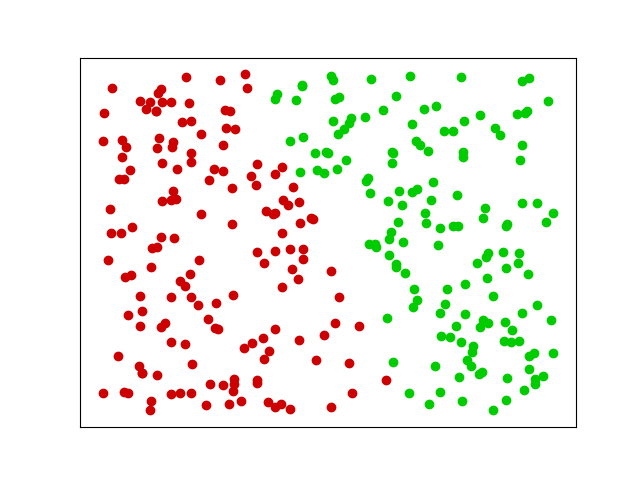
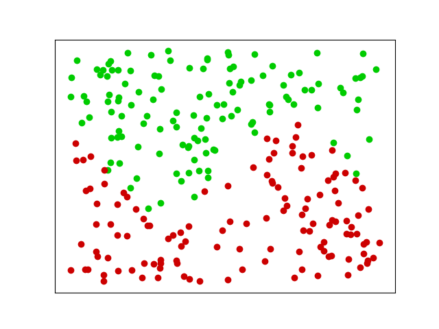
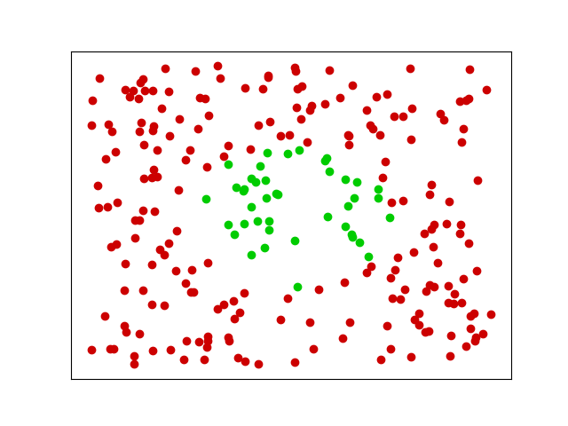
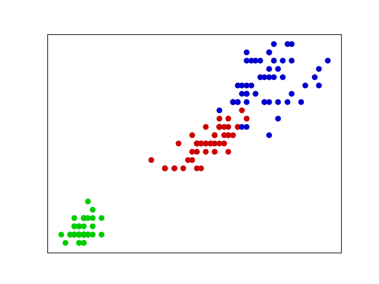
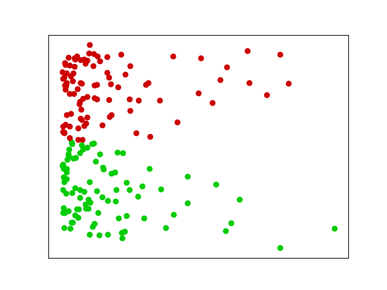
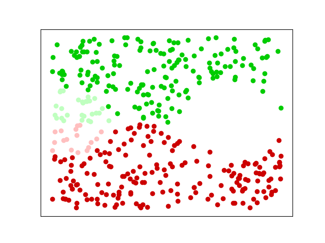
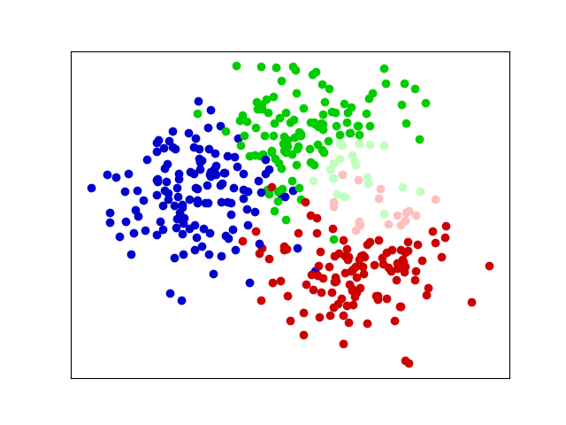
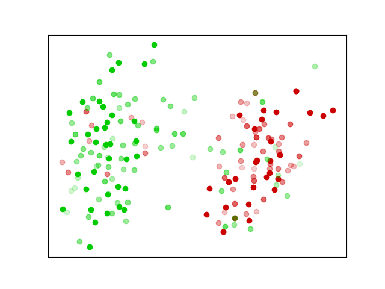
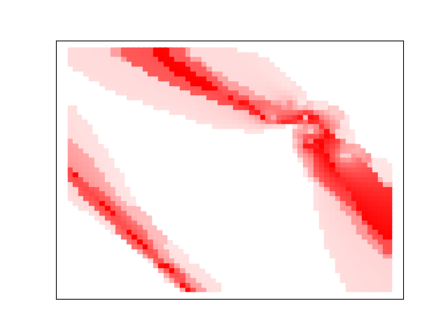

# Evidential Uncertainty Sampling

Experiments for the use of evidential uncertainty sampling.  

## How to use

Modify and execute *main.py*.  

```python
DATASET = "IRIS" 
CERTAINTY = "UNC"
```

DATASET accepted values : IMP, IRIS, LINE, SIN, CIRCLE, LOG, TRIPLE, DOG  
CERTAINTY accepted values : UNC, EP, EV_UNC, PL

Run code:  
*python3 main.py*

## Datasets

The dataset can be chosen from the following:  

LINE | SIN | CIRCLE | IRIS  
:--:|:--:|:--:|:--:
 |   |  | 

LOG | IMP | TRIPLE | DOG  
:--:|:--:|:--:|:--:
 |   |  | 

## Uncertainties

The uncertainty used for sampling can be chosen from the following:  

UNC | EP | EV_UNC | PL
:--|:--:|:--:|:--:
Classical | Epistemic | Klir | Evidential Epistemic

Note that for Epistemic and Evidential Epistemic uncertainties, aleatoric and total uncertainties are also displayed.  
For Klir uncertainty, Discord and Non-specificity are also displayed.

## Example

Example on the dataset Iris with the least confidence measure. The following parameters are used:  

```python
DATASET = "IRIS" 
CERTAINTY = "UNC"
```

Output:  

DATASET | UNCERTAINTY 
:--:|:--:
 |   

## Faster run

Computation time can be reduced by reducing the size of the uncertainty grid (it will only lower the definition of the representation):

```python

# Size of the uncertainty grid,
# can be reduced to go much faster
SIZE_X1 = 60
SIZE_X2 = 50

```
